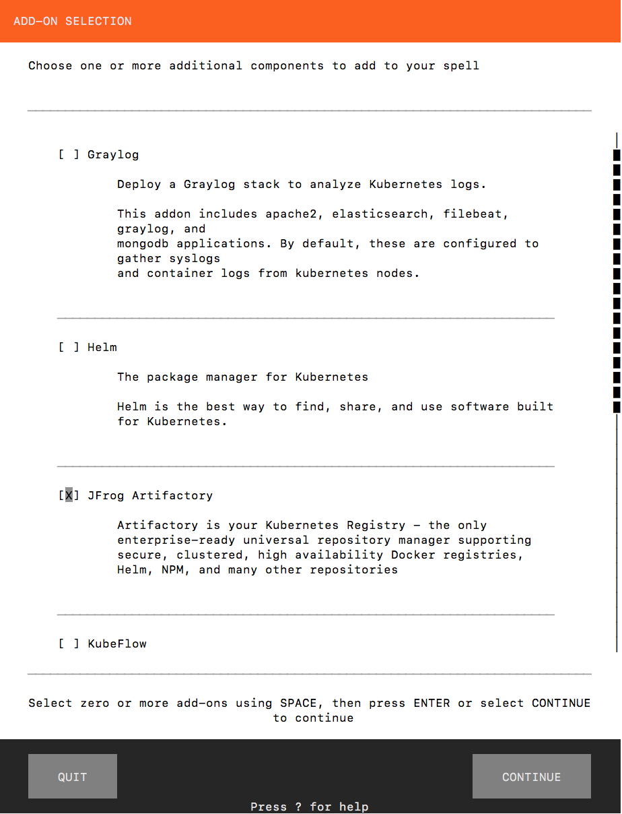
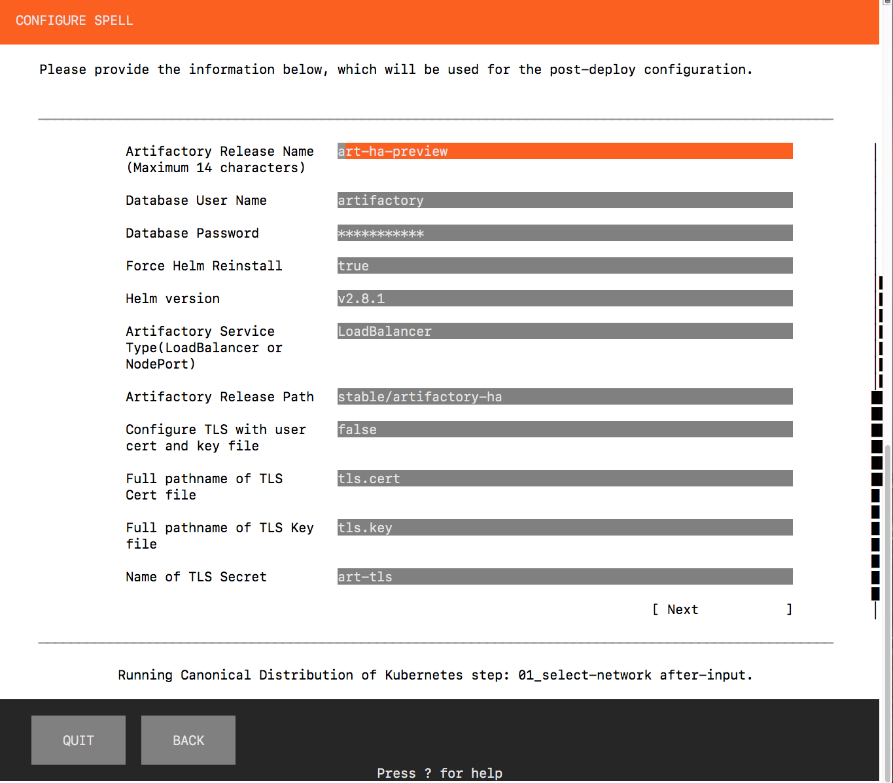
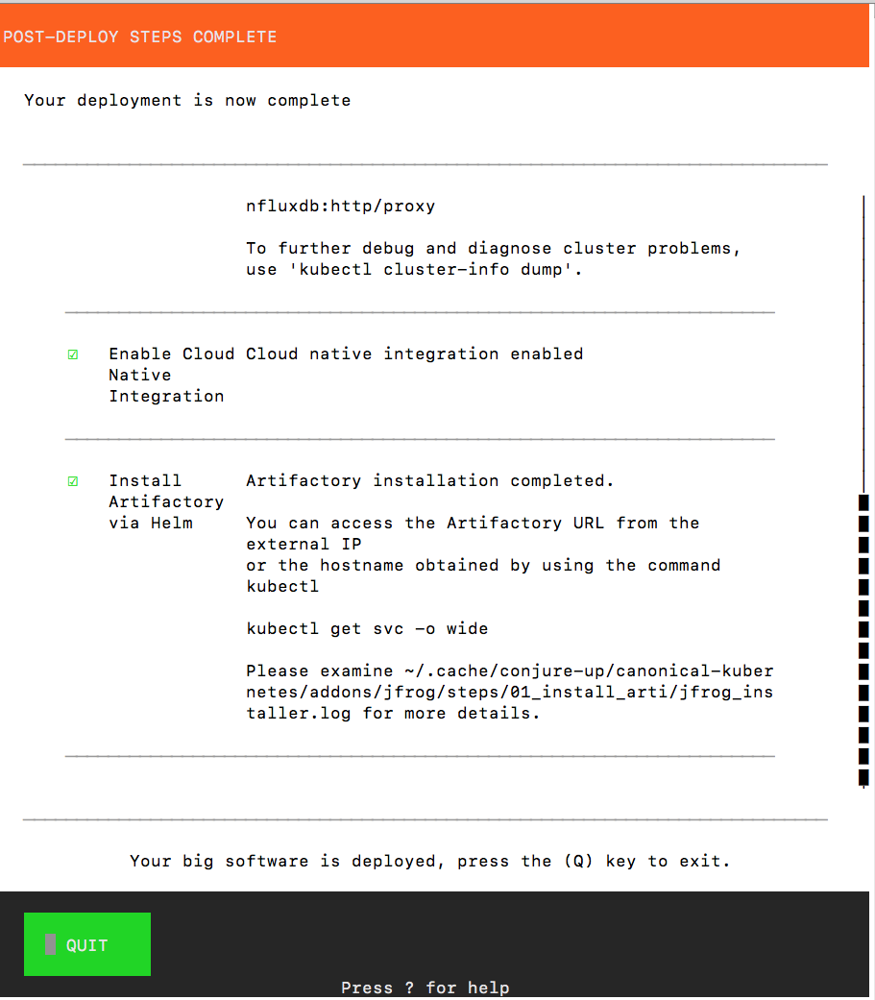

# JFrog Artifactory Enterprise Addon to Charmed-Kubernetes Spell

Select this Addon to install Artifactory Enterprise on a Charmed Distribution of Kubernetes (CDK) Cluster in the cloud (currently AWS only) and region you have already selected. After completing this installation JFrog Artifactory will be installed on your Kubernetes cluster. Once you apply the Artifactory licenses you will be able to use Artifactory as a Docker registry, Helm repo, NPM repo and more.

## Prerequisites:

- AWS:- Amazon AWS Account setup with all privileges required to create a Kubernetes Cluster, create persistent storage, and run load balancers.

- AWS Secret and Key available.

- Installation machine (where you install and run conjure-up)
  -  sudo privileges
  -  OS is certified by JFrog(<http://www.jfrog.com>) and Canonical(<http://wwww.canonical.com>) (e.g Ubuntu 16.04 LTS).
  -  Conjure-up dependencies installed (python, jq, perl)


- conjure-up installed. Please see http://conjure-up.io for more details on conjure-up. Please note that JFrog has tested against the self hosted controller option. Juju as A Service (Jaas) option has not been cerfified by JFrog.

- Licenses for Artifactory Enterprise Edition 5.9 or later versions from JFrog. You can obtain Enterprise Edition trial licenses from https://jfrog.com/artifactory/free-trial/#enterprise

## Basic installation

1. Run `conjure-up charmed-kubernetes` and select the JFrog Addon.





2. For a basic installation, accept all default choices for JFrog menu items and select Next to deploy all.




3. After you see the "Your big software is deployed", you can see the successful installation of Artifactory message. If you do not, scroll down and follow the instruction to obtain the Artifactory URL.  This is how the screen looks like:




The main command to use here is "kubectl get svc -o wide". On AWS, the external hostname of the LoadBalancer for nginx is the one that needs to be used as the artifactory URL. Opening up the Artifactory URL will prompt you to input the Licenses and the Artifactory documentation can then be followed to configure Artifactory.

For detailed explanation of how to find the URL of artifactory, please review the documentation available on official Kubernetes charts maintained on Github at https://github.com/kubernetes/charts/tree/master/stable/artifactory-ha

## Custom installation

If the Basic installation is not suitable, then instead of accepting the defaults, the selections can be changed. Here is a brief description of the choices provided.

1. Artifactory release name: Use a name for artifactory not exceeding 14 characters. For example, my-art-ha
2. Database User: Artifactory by default creates a PostgresQL database user with the id artifactory. You can change the database user here.
3. Database password: You change the default password for the database here.
4. Force Reinstall Helm: You can use this to reinstall a new version of Helm.
5. Helm version: If you would like a specific version due to known issues with the latest, you can specify it here.
6. Artifactory Service Type: Recommended to use LoadBalancer. NodePort is preferred if you already have a LoadBalancer.
7. Artifactory release path: You can specify release path here using the format `<repo>/<release>`. For example, `stable/artifactory-ha`
8. Configure TLS can be set to true and in this case, provide the TLS cert and TLS key file location and the secret file name you would like to use.


Additional customizations can be made by including the appropriate values in values.yaml in JFrog Addon. Consult official JFrog documentation for details

## Upgrading JFrog Artifactory.

Upgrading Artifactroy after it has already been installed via conjure-up is accomplished by running helm with the upgrade option.

1. Run `helm get values <release-name> --all > values-pre.yaml` to review the current settings and make a list of parameters that need to be overwritten with the new values.

2. If the list of parameters and values to be changed is too long, prepare a new values-upg.yaml, otherwise  they can be specified using "--set <param=value>" options to the upgrade command.

3. Run the helm upgrade command and specify the old values-pre.yaml file and new values-upg.yaml and override any thing that needs to be changed.

Typical upgrade commands for the release name "art-ha": 

```
An example to upgrade with the new values-upg.yaml and also override a parameter


helm get values art-ha --all > values-pre.yaml; 
helm upgrade art-ha stable/artifactory-ha -f values-pre.yaml -f values-upg.yaml --set artifactory.livenessProbe.failureThreshold=15
```

```
An example to upgrade with two overriding parameters (update artifactory and nginx docker images to  version 6.1.0) 


helm get values art-ha --all > values-pre.yaml; 
helm upgrade art-ha stable/artifactory-ha -f values-pre.yaml --set artifactory.image.version=6.1.0 --set nginx.image.version=6.1.0
```

Confirm  from `helm status art-ha` command that all the pods are in "Running" status and ready again.


## Developer Notes on Various Issues

### Persistence Storage Handling

The installation silently creates a Persistence Storage Class definition with the name jfrogstandard. This storage class name is referred to in the install via the values.yaml. There is a template for storageclass generation with the name zstorageclass.yaml with the following contents.

```
apiVersion: storage.k8s.io/v1
metadata:
  name: jfrogstandard
  annotations:
    storageclass.beta.kubernetes.io/is-default-class: "false"
provisioner: kubernetes.io/aws-ebs
parameters:
  type: gp2
  zone: ZONE
reclaimPolicy: Retain
mountOptions:
  - debug
```

Using the "juju status" command, we obtain a list of applicable zones and pick the first one and generate a new storageclass file replacing the ZONE value with the selected ZONE. So the generated storageclass file gen_storageclass.yaml would look like this.
```
apiVersion: storage.k8s.io/v1
metadata:
  name: jfrogstandard
  annotations:
    storageclass.beta.kubernetes.io/is-default-class: "false"
provisioner: kubernetes.io/aws-ebs
parameters:
  type: gp2
  zone: us-east-1a
reclaimPolicy: Retain
mountOptions:
  - debug
```

This file is then used by the addon script to create a persistence storageclass via the kubectl command

### Post Install Display message

After the installation is complete, it generally takes a while for all pods deployed to be active and runnning and also to access the URL of the artifactory, the LoadBalancer has to publish the external IP or hostname.  We could point to the Helm installer output log files but that output at this time is also not specific to the current cloud deployment. So currently we provide very basic general instructions to get the LoadBalancer URL and refer to our published documentation for mode details.

Please note that to see the post install message, on conjure-up output you might have to scroll down to see the screen.
This might be changed in future.


### Troubleshooting

Any debug messages printed via 'echo' in the addon scripts show up on the conjure-up screen at the lower status bar, but they get replaced by the next one. If these need to be reviewed post install, then navigate to ~/.cache/conjure-up directory and locate the addon script directory and see files with .out and .err extensions. They include all the standard output and standard error messages of the scripts. The output of helm installer for JFrog artifactory is redirected in the addon script to a log file jfrog_installer.log and this along the with other .out and .err can be used to debug any issues.


### Known Issues

**1.** When a node in Kubernetes cluster is deleted, the node does not get restarted. If the storage 
class is also created in the same zone as this node, then essentially all the services in other nodes
become dependent on this node which results in a loss of HA functionality until this node is manually restarted
using the juju commands. 

A typical example to restart all nodes in the cluster is to execute the following command

juju run --application kubernetes-worker service snap.kubelet.daemon restart

Please refer to the following issues: https://github.com/juju-solutions/bundle-canonical-kubernetes/issues/592 and
https://github.com/juju-solutions/bundle-canonical-kubernetes/issues/594 

**2.** On some rare occasions, the state of the pods become "Unknown"
or "Pending" and remains in that state for hours.
Deleting the pods will keep the pods stuck in "Terminating" state and the new pods remaining in init state. 
Please refer to the following issue https://github.com/juju-solutions/bundle-canonical-kubernetes/issues/609
Recovery of the cluster will require the assistance of kubernetes administrator.


## References

Conjure-up documentation: https://conjure-up.io/

Artifactory documentation: http://wwww.jfrog.com

Conjure-up on Github: https://github.com/conjure-up

JFrog Addon Documentation: https://github.com/conjure-up/spells/blob/master/canonical-kubernetes/addons/jfrog/README.md
